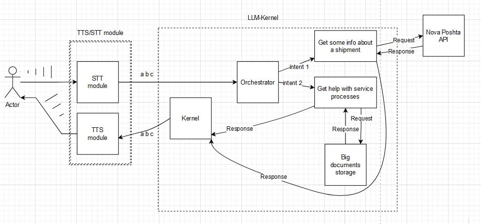

# NovaChat - {Innovation Hackathon} by NovaPoshta 

This repository contains the solution developed by the **Blue Cloud** team during the **{хaкaтон інновацій}** organized by NovaPoshta, held from August 18th to 20th in Kyiv.

## Problem Statement
The challenge was to develop an AI assistant capable of answering various customer questions related to NovaPoshta's services and processes. The AI assistant should be able to learn and respond to customer queries about services, shipment tracking, cost calculations, and delivery timelines.

### Original task formulation:

Case 1: the AI assistant can respond to any questions from our customers

Tasks for participants:
- Development of a neural network for an AI assistant that is capable of learning and answer customer questions about the company's services and processes;
- Training the AI assistant in basic operations, such as parcel tracking,
calculation of the cost of the service and informing about delivery times.

Additional Information:
- The AI assistant does not have access to the customer database, but it can
use work process instruction documents;
- The AI assistant must learn voice-to-text and text-to-voice functions to
understand customers and communicate freely with them;
- The AI assistant can work as a self-service workplace, as well as on the website or mobile application of Nova Poshta.

## Solution Overview
Our solution focuses on building an AI assistant that utilizes neural networks and AI-powered capabilities to provide accurate and helpful responses to customer inquiries based on internal documents like Terms of Service and Nova Poshta API. The solution includes the following components:

**NLP Processor**: This component is responsible for processing natural language inputs from customers. It uses SemanticKernel and OpenAI's GPT-4 to analyze the input queries and generate relevant responses using NovaPoshta documents and API.

**IO Service**: The IO service manages the input and output functionalities of the AI assistant. It handles speech-to-text and text-to-speech conversions using Azure Cognitive Services to facilitate seamless communication with customers.

**Web Frontend**: The web frontend provides an intuitive user interface for customers to interact with the AI assistant. It's built using Vue.js and allows customers to input queries through both text and speech.

## Features
- Supports both text and speech inputs from customers.
- Utilizes OpenAI GPT-4 for advanced natural language processing.
- Offers voice and text responses to customer queries.
- Interfaces with NovaPoshta's documentation and work process instructions.
- Provides accurate information about services, shipment tracking, costs, and delivery times.

## Getting Started
- Clone this repository: `git clone https://github.com/your-username/hackathon-repo.git`
- Update compose.yml with your OpenAI and Azure keys.
- Run the application: `docker-compose up`
- Use the web frontend to interact with the AI assistant.

## Usage
- Open the web frontend in your browser: http://localhost:5000
- Input your query using text or speech.
- Receive responses from the AI assistant.
